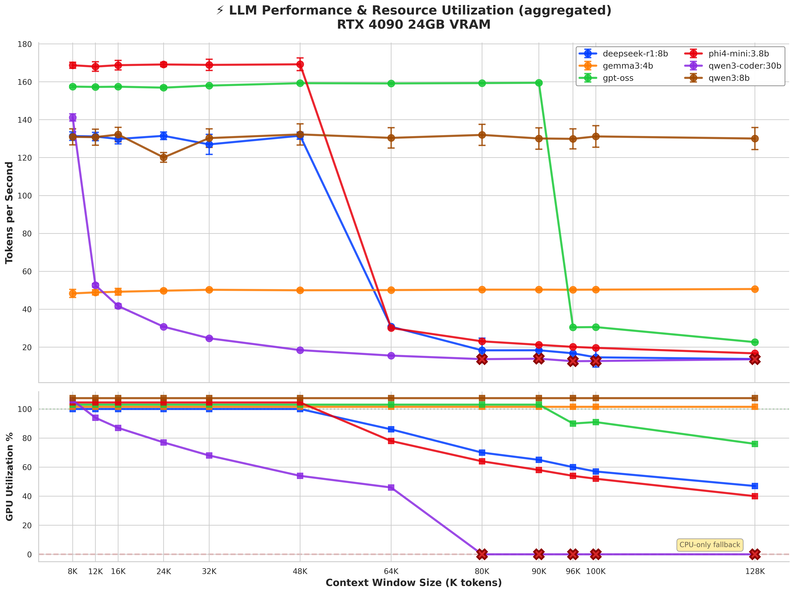

# Performance Benchmarks

**Hardware:** RTX 4090 24GB VRAM | **Data:** Aggregated across 10 runs per configuration

## Performance Overview



*Combined view: Performance (tokens/sec) on top, GPU utilization below. Lines stacked above 100% = full GPU utilization.
Red X = CPU-only fallback.*

## Key Findings

### 🏆 Best For Long Context + Capability

**gpt-oss (21B params)** — Large capable model that stays efficient at 100K context via MXFP4 quantization.

- **100K context:** 29.5 t/s @ 24GB VRAM (91% GPU)
- **Memory growth:** +9GB from 8K to 100K
- **Unique advantage:** Combines model capability with long context efficiency

### ⚡ Most Stable Performance

**qwen3:8b** — Minimal performance degradation across all context sizes.

- **8K:** 124.6 t/s | **100K:** 123.0 t/s (±2% variance)
- **Memory:** 7.9GB → 18GB (+10.1GB)
- **100% GPU** at all context sizes

### 💚 Most Memory Efficient

**gemma3:4b** — Smallest footprint for long context work.

- **100K context:** 50.1 t/s @ 10GB VRAM (100% GPU)
- **Memory growth:** Only +4.2GB from 8K to 100K
- **Trade-off:** 4B params = limited capability

### ⚠️ RAM Spillover Risk

**phi4-mini & deepseek-r1** — Fast at short context, crash beyond 64K.

- **phi4-mini:** 161 t/s @ 8K → 19 t/s @ 100K (52% GPU, 48% RAM)
- **deepseek-r1:** 127 t/s @ 8K → 17 t/s @ 100K (60% GPU, 40% RAM)

## Memory Usage


*VRAM consumption grows linearly with context size. Red X markers indicate CPU-only fallback (model offloaded to RAM).*

## Recommendations

| Scenario                             | Model         | Why                                     |
| ------------------------------------ | ------------- | --------------------------------------- |
| **Complex reasoning + long context** | `gpt-oss`     | Large model stays efficient at 100K     |
| **Stable production workloads**      | `qwen3:8b`    | Consistent performance across all sizes |
| **Memory-constrained environments**  | `gemma3:4b`   | Only 10GB at 100K context               |
| **Quick tasks (\<32K context)**      | `phi4-mini`   | Fastest speed for short work            |
| **Coding tasks**                     | `qwen3-coder` | Best for code, but large (30B)          |

## The MXFP4 Advantage

**gpt-oss** achieves its unique performance through:

1. **MXFP4 quantization:** 4.25 bits/param (7.5× compression, \<0.3% quality loss)
2. **MoE architecture:** 21B total params, only 3.6B active per token
3. **Efficient KV cache:** Quantized context storage

**Result:** 100K context in 24GB VRAM at 150+ t/s, maintaining model capability.

______________________________________________________________________

## Run Your Own Benchmarks

```bash
cd ollama/benchmark

# Quick test
./bench.sh phi4-mini:3.8b

# Full context matrix
./matrix.sh

# Generate charts
./visualize.sh
```

**See `ollama/benchmark/README.md` for full documentation.**

______________________________________________________________________

**Methodology:** Each metric averaged across 10 independent runs per configuration (12 context sizes: 8K → 128K).
Standard test prompt used for all models. Charts generated from `ollama/benchmark/results/` data with error bars showing
standard deviation.
