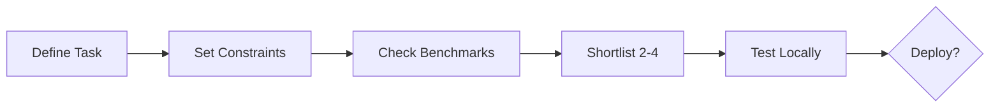
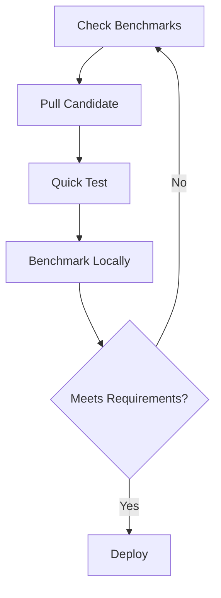

# 🎯 Local LLM Model Selection Guide

> **Data-driven process to pick, size, and validate local models with Ollama**

______________________________________________________________________

## ✅ How To Choose (Checklist)



1. **📋 Define your task:** chat/assistant, coding, reasoning, long documents, embeddings
2. **⚙️ Set constraints:** VRAM available, context length needed, latency target
3. **📊 Check benchmarks:** See `benchmark/results/charts/` for performance data
4. **🎯 Shortlist 2–4 candidates** matching your task and constraints
5. **🧪 Test locally** with your actual prompts and workload

______________________________________________________________________

## 🔄 Quick Evaluation Loop

### 1️⃣ Inspect a candidate

```bash
ollama show <model>
```

> Check parameters, quantization, and context window

### 2️⃣ Pull and test

```bash
ollama pull <model>
ollama run <model>
```

**Use representative prompts:**

- 💻 **Coding:** Paste a real code snippet
- 📄 **Documents:** Use a typical question with context
- 💬 **Chat:** Test with your actual use cases

### 3️⃣ Benchmark performance

```bash
cd benchmark
./bench.sh <model>
```

**Compare:**

- ⚡ Tokens/second at your target context size
- 💾 Memory usage (GPU vs RAM)
- 📊 Stability across multiple runs

### 4️⃣ Check memory headroom

**Monitor during inference:**

```bash
nvtop              # NVIDIA
nvidia-smi -l 1    # Alternative
```

> \[!TIP\] Leave **2-4GB margin** for KV cache growth. If near limits: try smaller model or lower quantization.

______________________________________________________________________

## 📊 Data-Driven Sizing (RTX 4090)

Based on **actual benchmark results** from this repo:

### By Context Length Need

<table>
<tr>
<th>Context Range</th>
<th>Recommended Models</th>
</tr>
<tr>
<td><b>&lt;32K tokens</b></td>
<td>

- ⚡ `phi4-mini:3.8b` — Fastest (170 t/s, 6GB)
- 🏆 `qwen3:8b` — Most stable (130 t/s, 8GB)

</td>
</tr>
<tr>
<td><b>32K-64K tokens</b></td>
<td>

- 🎯 `qwen3:8b` — Best balance (130 t/s, 15GB)
- 🌟 `gpt-oss` — High capability (157 t/s, 17GB)

</td>
</tr>
<tr>
<td><b>64K-100K tokens</b></td>
<td>

- 🏆 `qwen3:8b` — Most stable (130 t/s, 18GB, 100% GPU)
- 🌟 `gpt-oss` — Efficient to 96K (160 t/s, then degrades)
- 💚 `gemma3:4b` — Most efficient (50 t/s, 10GB)

</td>
</tr>
<tr>
<td><b>&gt;100K tokens</b></td>
<td>

- 💚 `gemma3:4b` — **Only option** that stays on GPU (50 t/s, 12GB @ 128K)
- ⚠️ Others hit CPU fallback with severe degradation

</td>
</tr>
</table>

### By VRAM Constraint

| **Available VRAM** | **Recommended Models**                                                      | **Max Context** |
| :----------------: | :-------------------------------------------------------------------------- | :-------------: |
|     **\<12GB**     | `gemma3:4b`                                                                 |      128K       |
|    **12-24GB**     | `qwen3:8b` (best) / `phi4-mini:3.8b` (\<32K) / `gpt-oss` (to 96K)           |     Varies      |
|     **24GB+**      | All models at short context / Only `qwen3:8b` + `gemma3:4b` stable at 100K+ |      128K       |

### By Task Type

| **Task**              | **Model**         | **Notes**                                |
| :-------------------- | :---------------- | :--------------------------------------- |
| 💬 General chat       | `qwen3:8b`        | Proven stability across all tests        |
| 💻 Coding             | `qwen3-coder:30b` | Best quality but **CPU fallback >64K**   |
| 💻 Coding (long)      | `qwen3:8b`        | Better for long code contexts            |
| 📄 Long documents     | `gpt-oss`         | 21B params for comprehension (to 96K)    |
| 💚 Memory-constrained | `gemma3:4b`       | Smallest footprint, handles long context |

______________________________________________________________________

## 🎨 Quantization Impact

**Tested models use:**

| Type      | Model       | Quality/Size   | Notes                        |
| :-------- | :---------- | :------------- | :--------------------------- |
| **Q4**    | Most models | Good balance   | Standard for 24GB systems    |
| **MXFP4** | `gpt-oss`   | Better quality | Special 4-bit with less loss |

<details>
<summary><b>Rules of thumb</b></summary>

<br>

- **Q4_K_M** — Strong default for 24GB systems
- **Q5/Q6** — Better quality, higher memory (not tested here)
- **Q3/Q2** — Smaller but noticeable quality loss

</details>

______________________________________________________________________

## 📈 Context Window Reality Check

> \[!IMPORTANT\] **Benchmark finding:** Context size drives VRAM allocation (KV cache grows linearly)

### VRAM Growth per 10K Context (Measured)

```text
gemma3:4b        ████░░░░░░  ~0.4GB  (most efficient KV cache)
qwen3:8b         ██████████  ~1.0GB  (excellent)
gpt-oss          █████████░  ~0.9GB  (excellent with MXFP4)
phi4-mini:3.8b   ████████████████████  ~4.0GB  (poor, hits VRAM limit)
deepseek-r1:8b   ███████████████  ~3.0GB  (poor, hits VRAM limit)
```

> \[!NOTE\] These numbers represent **VRAM allocated** for KV cache as context window increases, not text processing
> overhead. The context size parameter tells Ollama how much memory to pre-allocate.
>
> \[!WARNING\] **Performance cliff:** Once VRAM is exhausted (>24GB on RTX 4090) and models spill to RAM, performance
> drops **80-90%**

**Visual proof:** See `benchmark/results/charts/memory.png` for the red X markers!

______________________________________________________________________

## 🌟 2025 Model Families

Based on benchmark + external evaluation:

<table>
<tr>
<td width="50%">

### 💬 General/Multilingual

**Qwen3** (`qwen3:8b`)

- ✅ Proven stable in benchmarks
- 🔗 [ollama.com/library/qwen3](https://ollama.com/library/qwen3)

### 💻 Coding

**Qwen3 Coder** (`qwen3-coder:30b`)

- ✅ Best quality
- ⚠️ Context-limited (CPU >64K)
- 🔗 [ollama.com/library/qwen3-coder](https://ollama.com/library/qwen3-coder)

### 📄 Long Context

**GPT-OSS** (`gpt-oss`)

- ✅ 21B params via MXFP4
- 📁 Custom modelfile in `modelfiles/`

</td>
<td width="50%">

### 💚 Memory Efficient

**Gemma 3** (`gemma3:4b`)

- ✅ Smallest that works long-context
- 🔗 [ollama.com/library/gemma3:4b](https://ollama.com/library/gemma3:4b)

### ⚡ Fast/Short Context

**Phi-4 mini** (`phi4-mini:3.8b`)

- ✅ Speed champion \<32K
- 🔗 [ollama.com/library/phi4-mini](https://ollama.com/library/phi4-mini)

### 🧠 Reasoning

**DeepSeek R1** (`deepseek-r1:8b`)

- ✅ Good \<32K
- ⚠️ Degrades beyond
- 🔗 [ollama.com/library/deepseek-r1](https://ollama.com/library/deepseek-r1)

</td>
</tr>
</table>

### 🔍 Embeddings

**For RAG applications:**

- **BGE-M3** (`bge-m3`) — [ollama.com/library/bge-m3](https://ollama.com/library/bge-m3)
- **Nomic Embed** (`nomic-embed-text`) —
  [ollama.com/library/nomic-embed-text](https://ollama.com/library/nomic-embed-text)

______________________________________________________________________

## ✨ Validation Workflow



**Step-by-step:**

1. 📊 **Check benchmarks** → `benchmark/results/charts/`
2. ⬇️ **Pull candidate** → `ollama pull <model>`
3. 🧪 **Quick test** → `ollama run <model>`
4. 📈 **Benchmark locally** → `cd benchmark && ./bench.sh <model>`
5. 🔄 **Compare results** to reference data
6. 🚀 **Deploy** if performance meets requirements

______________________________________________________________________

## 📚 See Also

- 🏠 [Main README](./README.md) — Quick start and integration
- 📊 [Benchmark README](./benchmark/README.md) — Detailed testing docs
- 📈 [Benchmark Charts](./benchmark/results/charts/) — Visual performance data

______________________________________________________________________

<div align="center">

**💡 Pro Tip:** Always test with YOUR actual workload before deploying!

</div>
