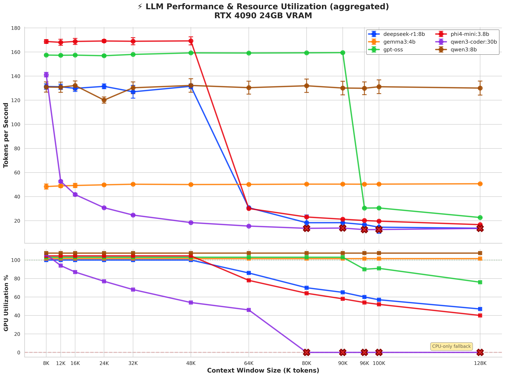

# 🦙 Ollama Integration

> **Run powerful local LLMs with n8n workflows** Native installation recommended for best GPU performance

______________________________________________________________________

## 📊 Performance Benchmarks (RTX 4090)

Real-world testing across **12 context sizes** (8K → 128K) with **10 runs** per configuration

### 🎯 The Complete Story



**What this shows:**

- **TOP:** Performance (tokens/sec) — flat = stable, drops = hitting limits
- **BOTTOM:** GPU utilization — stacked at 100%+ = full GPU, declining = RAM spillover, 0% = CPU-only 💀

**Key insights:**

- 🏆 **gemma3:4b** (orange) — Stays 100% GPU even at 128K (most efficient)
- 💪 **qwen3:8b** (brown) — Rock solid performance, plateaus at 24GB VRAM but stays on GPU
- 🎯 **gpt-oss** (green) — Strong to 96K, then performance cliff at 128K
- ⚠️ **phi4-mini/deepseek-r1** — Start fast but crater when GPU% drops at 64K+
- 🔴 **Red X** = CPU-only fallback (80-90% performance loss)

<details>
<summary><b>💾 VRAM Allocation Deep Dive</b></summary>

<br>


**Memory growth patterns:**

- 💚 **gemma3:4b** — Linear growth to 12GB @ 128K (most efficient KV cache)
- ⚠️ **qwen3:8b** — Hits 24GB VRAM ceiling @ 48K, plateaus
- 📊 **gpt-oss** — Steady growth to ~27GB @ 128K
- 🔴 **CPU-only points** — VRAM freed when model offloads completely

> **Note:** Memory = VRAM allocated for model weights + KV cache at specified context size

</details>

______________________________________________________________________

## 🎯 Choose Your Champion

| **Scenario**           | **Model**        | **Why**                          |
| :--------------------- | :--------------- | :------------------------------- |
| 📝 Long documents      | `gpt-oss`        | 21B params stay efficient to 96K |
| 🏭 Production stable   | `qwen3:8b`       | Most consistent (4% variance)    |
| 💰 Memory-constrained  | `gemma3:4b`      | Only 12GB @ 128K                 |
| ⚡ Quick tasks (\<32K) | `phi4-mini:3.8b` | Fastest (170 t/s)                |

> \[!TIP\] **See full analysis:** [`benchmark/results/charts/`](benchmark/results/charts/) for interactive visual data

______________________________________________________________________

## 🚀 Quick Start

<details>
<summary><b>1️⃣ Install Ollama (Native on Host)</b></summary>

<br>

**Linux + NVIDIA:**

```bash
sudo bash scripts/install_ollama_linux_nvidia.sh
sudo bash scripts/tune_env_nvidia.sh
```

**macOS + Apple Silicon:**

```bash
bash scripts/install_ollama_macos_apple_silicon.sh
bash scripts/tune_env_macos.sh
```

</details>

<details>
<summary><b>2️⃣ Pull Models</b></summary>

<br>

```bash
# 🏆 Most stable all-rounder
ollama pull qwen3:8b

# 🎯 Best for long context + capability
ollama pull gpt-oss

# 💚 Most memory efficient
ollama pull gemma3:4b

# ⚡ Fastest for short tasks
ollama pull phi4-mini:3.8b
```

</details>

<details>
<summary><b>3️⃣ Connect to n8n</b></summary>

<br>

Ollama runs on host at `localhost:11434` n8n containers access via `host.docker.internal:11434`

**HTTP Request Node:**

```json
{
  "url": "http://host.docker.internal:11434/api/generate",
  "method": "POST",
  "body": {
    "model": "qwen3:8b",
    "prompt": "{{$json.prompt}}",
    "stream": false
  }
}
```

**AI Agent Node:** Use the 'Ollama Chat Model' node directly ✨

</details>

______________________________________________________________________

## 🔬 Run Your Own Benchmarks

Test on **YOUR** hardware:

```bash
cd benchmark

# Quick single model test
./bench.sh qwen3:8b

# Full matrix (12 context sizes, all models)
./matrix.sh

# Generate visual reports
./visualize.sh
```

> \[!NOTE\] **Configuration:** Edit `benchmark/config/context_matrix.yaml` for:
>
> - Context sizes to test
> - Models to benchmark
> - Number of repeat runs (for statistical reliability)

**📖 Detailed docs:** [`benchmark/README.md`](benchmark/README.md)

______________________________________________________________________

## 🎛️ Model Selection Guide

### By Use Case

| **Need**              | **Model**         | **Size** | **Context** | **VRAM @ 100K** |
| :-------------------- | :---------------- | :------: | :---------: | :-------------: |
| 💬 General chat/tasks | `qwen3:8b`        |    8B    |    128K     |      18GB       |
| 📄 Long documents     | `gpt-oss`         |   21B    |    100K     |      24GB       |
| 💻 Coding             | `qwen3-coder:30b` |   30B    |    128K     |     38GB ⚠️     |
| 💚 Low memory         | `gemma3:4b`       |    4B    |    128K     |      10GB       |
| ⚡ Quick/short        | `phi4-mini:3.8b`  |   3.8B   |     32K     |       6GB       |

> \[!WARNING\] ⚠️ = CPU fallback beyond 64K context (80-90% performance loss)
>
> \[!NOTE\] **VRAM** = Allocated for model + KV cache at specified context size

<details>
<summary><b>📋 Selection Checklist</b></summary>

<br>

1. ✅ **Define constraints:** VRAM available, context length needed
2. 📊 **Check benchmarks:** Performance at your target context size
3. 🧪 **Test locally:** Use your actual prompts and workload
4. 📈 **Monitor resources:** GPU utilization, memory usage

**Detailed guide:** [`MODEL_SELECTION_GUIDE.md`](MODEL_SELECTION_GUIDE.md)

</details>

______________________________________________________________________

## 💡 Why Native (Not Docker)?

<table>
<tr>
<td>✅ <b>Direct GPU access</b></td>
<td>No virtualization overhead</td>
</tr>
<tr>
<td>✅ <b>Simpler drivers</b></td>
<td>No container-to-GPU mapping</td>
</tr>
<tr>
<td>✅ <b>Easier management</b></td>
<td>Simple <code>ollama pull/run</code> commands</td>
</tr>
<tr>
<td>✅ <b>Better performance</b></td>
<td>Native CUDA/Metal access</td>
</tr>
</table>

______________________________________________________________________

## 🔧 Troubleshooting

<details>
<summary><b>❌ Can't connect from n8n</b></summary>

<br>

```bash
# Check Ollama is running
curl http://localhost:11434/api/tags

# Use host.docker.internal from containers
# Or use LAN IP: http://192.168.1.x:11434
```

</details>

<details>
<summary><b>🐌 Slow performance</b></summary>

<br>

- Check GPU usage: `nvtop` (NVIDIA) or Activity Monitor (Mac)
- Verify tuning: `echo $OLLAMA_FLASH_ATTENTION` should be `1`
- Try smaller model or lower context size

</details>

<details>
<summary><b>🔍 Model not found</b></summary>

<br>

```bash
ollama list              # Check installed
ollama pull <model>      # Install missing model
```

</details>

______________________________________________________________________

## 🎓 Advanced Topics

<details>
<summary>Click to expand</summary>

<br>

- **🛠️ Custom Models:** Place Modelfiles in [`modelfiles/`](modelfiles/)
- **⚙️ Performance Tuning:** Environment variables in tuning scripts
- **📊 Benchmark Deep Dive:** [`benchmark/config/README.md`](benchmark/config/README.md)

</details>

______________________________________________________________________

## 📍 Next Steps

- [x] Install Ollama
- [x] Pull models based on benchmarks
- [ ] 🔬 Run your own benchmarks
- [ ] 🔗 Integrate with n8n workflows
- [ ] 📖 Optimize with [`MODEL_SELECTION_GUIDE.md`](MODEL_SELECTION_GUIDE.md)

> \[!TIP\] **Questions?** Check the benchmark visualizations in `benchmark/results/charts/` for data-driven insights.

______________________________________________________________________

<div align="center">

**🌟 Star this repo** if you find it helpful!

[Report Bug](../../issues) · [Request Feature](../../issues) · [Documentation](benchmark/)

</div>
